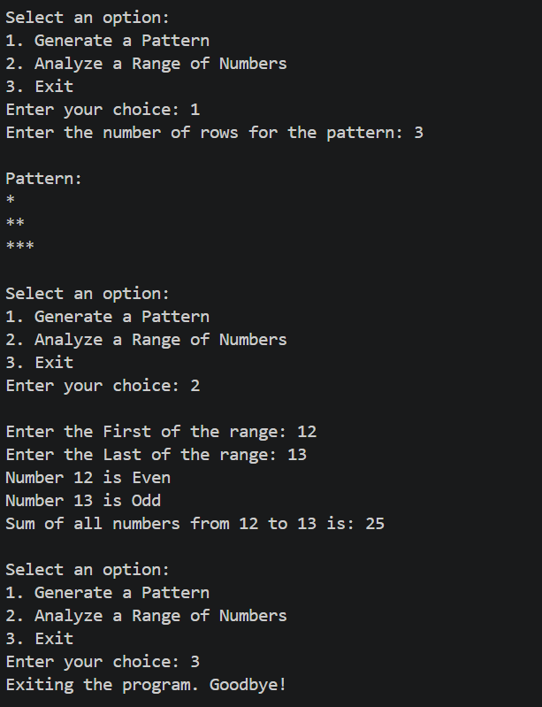

# 👩‍💻 Author

**Drashti Vadukul**

BCA Student | Learning Python, AI, ML & Data Science

---

# 🔢 Pattern Generator & Number Analyzer

A beginner-friendly **Python console-based project** that combines **star pattern generation** and **number analysis** into a simple menu-driven program.

This project is designed to strengthen fundamental Python concepts such as **loops, conditional statements, user input, arithmetic operations, and logical thinking**.

---

## 📌 Project Overview

The program displays a menu with three options:

* **1. Generate Pattern**
* **2. Analyze Numbers**
* **3. Exit**

The user can select an option, perform the required operation, and return to the main menu.

The program continues running until the user chooses the **Exit** option.

---

## ✨ Features

### ⭐ 1. Generate Pattern

The program asks the user to enter the number of rows.

It then generates a simple increasing star pattern.

Example:

```text
*
**
***
****
*****
```

If the user enters `0` or a negative number, the program displays an **Invalid number** message.

---

### 🔢 2. Analyze Numbers

The program asks the user to enter:

* Starting number
* Ending number

It then checks every number in the given range and identifies whether it is **Even or Odd**.

Example:

```text
1 is Odd
2 is Even
3 is Odd
4 is Even
5 is Odd
```

The program also calculates the **total of all numbers** in the given range.

Example:

```text
Total = 15
```

If the starting number is greater than the ending number, the program displays an **Invalid range** message.

---

### 🚪 3. Exit

When the user selects option `3`, the program displays:

```text
Goodbye!
```

and stops the program.

---

## 🧠 Python Concepts Used

This project uses several important Python fundamentals:

* `print()` – Display messages and results
* `input()` – Take input from the user
* `while` loop – Keep the menu running
* `for` loop – Repeat operations over a range
* `if-elif-else` – Make decisions
* `range()` – Generate a sequence of numbers
* `%` operator – Check Even and Odd numbers
* `break` – Exit the program
* `continue` – Skip the current iteration
* Arithmetic operators – Calculate the total
* Input validation – Handle invalid values

---

## 🔄 Program Flow

```text
Start
  ↓
Display Menu
  ↓
Take User Choice
  ↓
 ┌─────────────────────┐
 │                     │
 ↓                     ↓
Generate Pattern   Analyze Numbers
 │                     │
 ↓                     ↓
Return to Menu     Return to Menu
 │
 └──────────┬──────────┘
            ↓
        Exit Option
            ↓
           End
```

---

## 🛠️ Technologies Used

**Programming Language:** Python

**Project Type:** Console-Based Application

**Difficulty Level:** Beginner

**Environment:** VS Code / Python

---

## 🎯 Learning Objective

The main objective of this project is to understand how different Python fundamentals can work together to create a useful interactive program.

It helps in improving:

* Logical thinking
* Problem-solving skills
* Understanding of loops
* Understanding of conditions
* User input handling
* Basic Python programming confidence

---

## 🚀 Future Improvements

This project can be extended in the future by adding:

* More pattern types
* Sum of even and odd numbers separately
* Prime number checking
* Average calculation
* Multiplication table generation
* More number analysis options

---

## 📚 Conclusion

**Pattern Generator & Number Analyzer** is a simple project created to build a strong foundation in Python programming.

It demonstrates how **loops, conditions, operators, and user input** can be combined to create an interactive menu-driven application.

---

## 👩‍💻 Author

**Drashti Vadukul**

BCA Student | Aspiring Data Analyst
Learning Python | AI | ML | Data Science

⭐ *Learning step by step, building project by project.*


